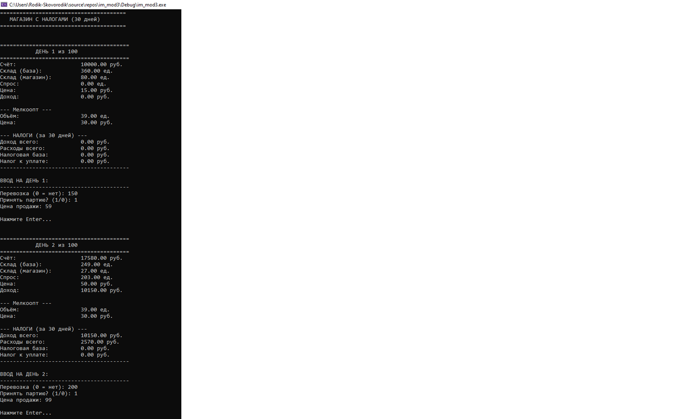

# 🧮 Имитационное моделирование — Лабораторная работа №3  
**Тема:** Моделирование деятельности магазина с учетом налоговых выплат.  

---

## 📘 Постановка задачи
Необходимо разработать имитационную модель работы магазина, в которой:
- происходит реализация товара через розничную торговлю;
- ведется учет доходов, расходов и налоговых выплат;
- моделируется мелкооптовое предложение (закупка товара);
- предусмотрена возможность покупки в рассрочку;
- реализован поэтапный ввод и вывод данных по дням.

Модель должна демонстрировать финансовое состояние предприятия (счет, склад, спрос, прибыль, налоги) в динамике на протяжении 100 дней.

---

## ⚙️ Описание модели
Магазин имеет **два уровня запасов**:
- **Базовый склад** — хранение закупленного товара.
- **Торговая точка (магазин)** — реализация товаров покупателям.

Основные **денежные потоки (темпы)**:
| Поток | Формула | Описание |
|--------|----------|----------|
| **Доход** | `sold * retPrice` | Доход от продаж |
| **Продажи** | `min(shopStore, demand)` | Проданное количество за день |
| **Спрос** | `100 * (100 / retPrice) + шум` | Зависит от цены и случайного фактора |
| **Расходы** | `700 + 200 + 500 = 1400 руб./день` | Постоянные затраты (закупки, аренда, зарплаты) |
| **Налог на прибыль** | `taxBase * 0.20` | Уплата каждые 30 дней при положительной прибыли |

---

## 🧾 Мелкооптовое предложение
- Появляется каждые **10 дней** (1, 11, 21, ...).  
- **Объем партии:** 30–50 ед. (случайно).  
- **Цена за единицу:** 30–40 руб.  
- Возможные варианты оплаты:
  1. **Сразу**, если хватает средств на счете.  
  2. **В рассрочку** — 3 или 6 равных платежей (первый — сразу).  

---

## 💻 Обобщённый алгоритм программы
1. **Получение инициализационных данных**  
   Определяются стартовые значения (счет, склад, цены, дни).
2. **Инициализация**  
   Создается структура состояния `ModelState`.
3. **Расчет уровней и темпов**  
   Выполняются вычисления спроса, продаж, расходов, налогов.
4. **Расчет темпов (flows)**  
   Производятся пересчеты всех динамических параметров модели.
5. **Вывод пошаговых данных**  
   Отображается состояние модели за каждый день.
6. **Ввод пошаговых данных**  
   Пользователь задает объем перевозки, цену, принимает или отклоняет предложение.
7. **Расчет налогов и платежей по рассрочке**  
   Каждые 30 дней происходит налоговый расчет, а также внесение очередных платежей.
8. **Вывод общих данных**  
   По завершении моделирования выводится итоговый отчет.

---

## 🧠 Основные параметры модели

| Параметр | Значение | Описание |
|-----------|-----------|----------|
| `INIT_ACCOUNT` | 10000 | Начальный счет |
| `PROFIT_TAX_RATE` | 0.20 | Налог на прибыль |
| `SIMULATION_DAYS` | 100 | Количество дней |
| `DAILY_SPENDING` | 700 | Ежедневные затраты |
| `RENT_RATE` | 200 | Аренда |
| `WAGES_AND_TAXES` | 500 | Зарплата и налоги |
| `TAX_PAYMENT_DAY` | 30 | Интервал уплаты налогов |

---

## 🖼️ Скриншот

